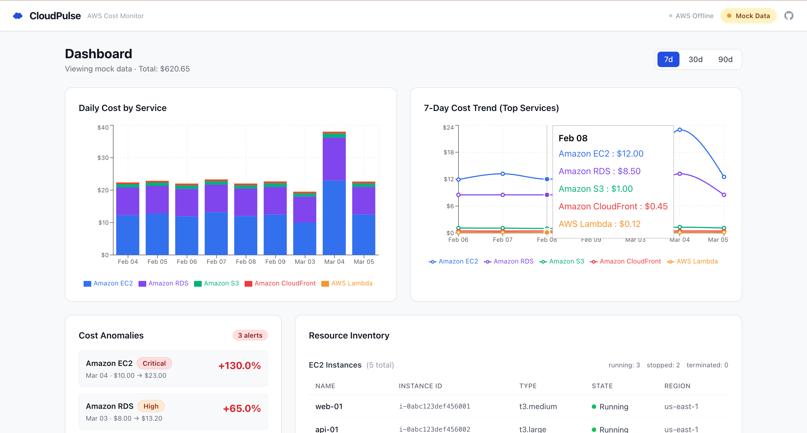
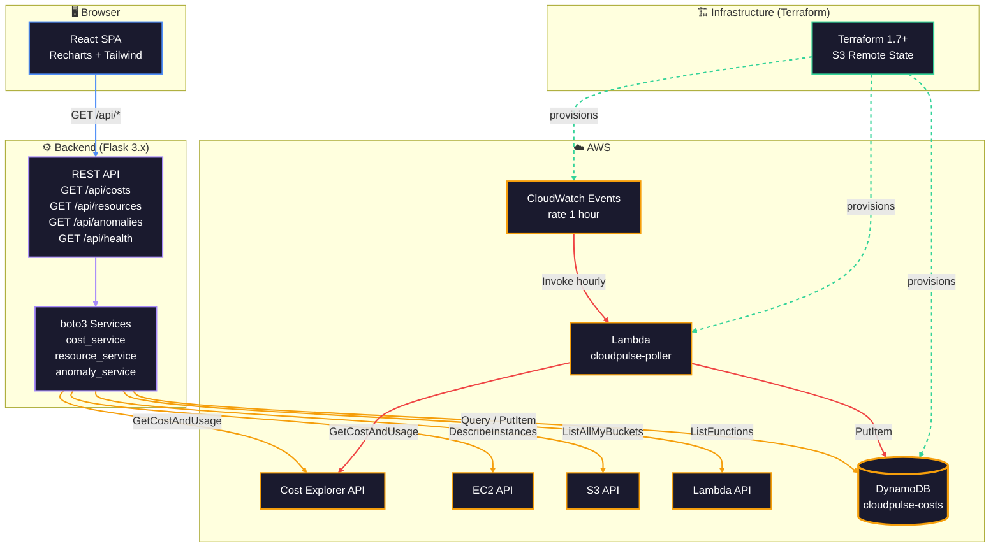
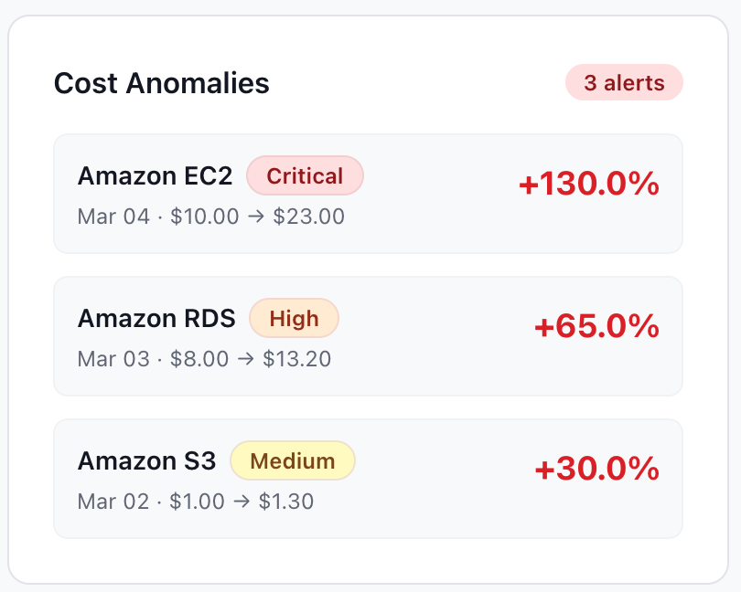
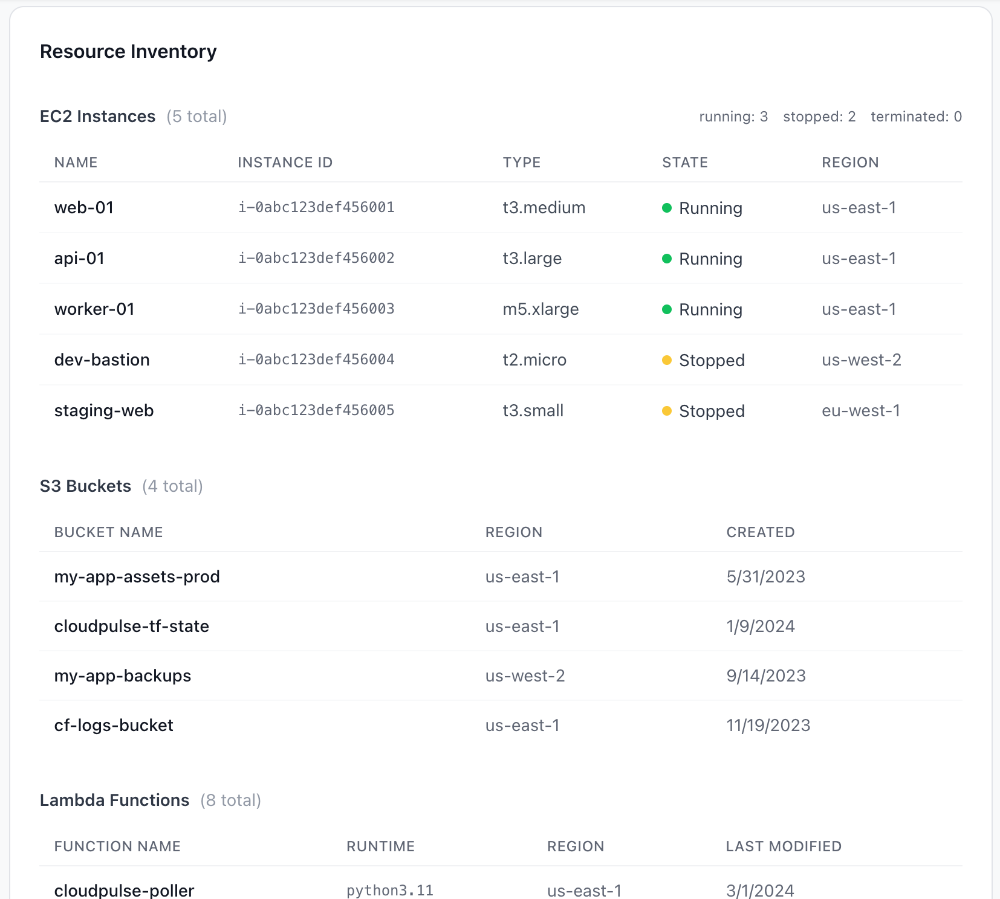
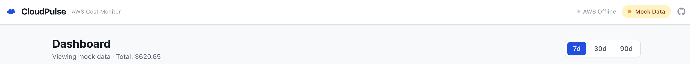

# CloudPulse

**Open-source AWS cost and resource monitoring — self-hosted, no SaaS fees.**

[](https://github.com/Spador/cloudpulse/actions/workflows/pr-checks.yml)
[](https://www.python.org/)
[](https://www.terraform.io/)
[](LICENSE)

---



---

## Features

- **Daily & monthly cost breakdown** by AWS service — bar chart with stacked view
- **7-day cost trend** — line chart for top services
- **Resource inventory** — EC2 instance count/state, S3 buckets, Lambda functions
- **Anomaly detection** — automatically surfaces >20% day-over-day cost spikes, ranked by severity
- **Mock mode** — runs fully without AWS credentials (perfect for demos and reviewers)
- **Infrastructure as Code** — Terraform provisions DynamoDB, Lambda, IAM, CloudWatch
- **CI/CD pipeline** — GitHub Actions lint + test + plan + deploy

---

## Architecture



---

## Prerequisites

| Tool | Version | Install |
|------|---------|---------|
| Python | 3.11+ | [python.org](https://python.org) |
| Node.js | 20 LTS | [nodejs.org](https://nodejs.org) |
| npm | 10+ | Bundled with Node |
| Terraform | 1.7+ | [developer.hashicorp.com](https://developer.hashicorp.com/terraform/downloads) |
| AWS CLI | 2.x | [docs.aws.amazon.com](https://docs.aws.amazon.com/cli/latest/userguide/install-cliv2.html) |
| AWS Account | - | Optional — mock mode works without it |

---

## Quick Start (Mock Mode — No AWS Required)

Run the app in under 5 minutes without any AWS account:

```bash
# 1. Clone the repo
git clone https://github.com/Spador/cloudpulse.git
cd cloudpulse

# 2. Start the backend in mock mode
cd backend
python -m venv .venv
source .venv/bin/activate          # Windows: .venv\Scripts\activate
pip install -r requirements.txt
MOCK_MODE=true FLASK_APP=app.py flask run --port 5000

# 3. Start the frontend (new terminal)
cd frontend
npm install
npm run dev

# Open http://localhost:5173 in your browser
# Use the "Mock Data / Live Data" toggle in the header to switch modes
```

---

## Full Setup (With AWS Account)

### Step 1 — Configure AWS credentials

```bash
aws configure
# Enter your Access Key ID, Secret Access Key, region (e.g. us-east-1)
```

### Step 2 — Bootstrap Terraform state bucket (one-time)

```bash
ACCOUNT_ID=$(aws sts get-caller-identity --query Account --output text)
STATE_BUCKET="cloudpulse-tf-state-${ACCOUNT_ID}"

aws s3 mb s3://${STATE_BUCKET} --region us-east-1
aws s3api put-bucket-versioning \
  --bucket ${STATE_BUCKET} \
  --versioning-configuration Status=Enabled

echo "State bucket: ${STATE_BUCKET}"
```

### Step 3 — Provision infrastructure

```bash
cd infra
cp terraform.tfvars.example terraform.tfvars
# Edit terraform.tfvars if needed

terraform init \
  -backend-config="bucket=${STATE_BUCKET}" \
  -backend-config="key=cloudpulse/terraform.tfstate" \
  -backend-config="region=us-east-1"

terraform plan
terraform apply
```

**Outputs after apply:**
- `dynamodb_table_name` — use this as `DYNAMODB_TABLE_NAME`
- `lambda_function_name` — the hourly poller
- `iam_role_arn` — IAM role for the app

### Step 4 — Configure environment

```bash
cd ..
cp .env.example .env
# Edit .env:
#   AWS_REGION=us-east-1
#   DYNAMODB_TABLE_NAME=cloudpulse-costs
```

### Step 5 — Seed initial data (optional but recommended)

```bash
source backend/.venv/bin/activate
python execution/snapshot_costs.py --days 90
```

This calls Cost Explorer and populates DynamoDB with 90 days of history.

### Step 6 — Start the backend

```bash
cd backend
source .venv/bin/activate
FLASK_APP=app.py flask run --port 5000
```

### Step 7 — Start the frontend

```bash
cd frontend
npm run dev
# Open http://localhost:5173
```

---

## Environment Variables

See [`.env.example`](.env.example) for the full list.

| Variable | Purpose | Default |
|----------|---------|---------|
| `AWS_REGION` | AWS region | `us-east-1` |
| `DYNAMODB_TABLE_NAME` | DynamoDB table | `cloudpulse-costs` |
| `MOCK_MODE` | Force mock data | `false` |
| `FLASK_SECRET_KEY` | Flask session secret | *(set this in prod)* |
| `LOG_LEVEL` | Log verbosity | `INFO` |
| `VITE_API_BASE_URL` | Frontend API URL | `http://localhost:5000` |

---

## Mock Mode

CloudPulse auto-detects mock mode:
- **Backend**: if no AWS credentials are found, the API serves mock data automatically. Force it with `MOCK_MODE=true`.
- **Frontend**: use the toggle in the header bar to switch between "Mock Data" and "Live Data". State persists in `localStorage`.

To customize mock data, edit:
- `frontend/src/mock/costs.json`
- `frontend/src/mock/resources.json`
- `frontend/src/mock/anomalies.json`

---

## Development

### Running tests

```bash
# Backend
cd backend
source .venv/bin/activate
pip install -r requirements-dev.txt
pytest tests/ -v --cov=. --cov-report=term-missing

# Frontend
cd frontend
npm test
```

### Linting

```bash
# Python
flake8 backend/ execution/ --max-line-length=100

# TypeScript
cd frontend && npm run lint
```

### Local DynamoDB (no AWS account needed)

```bash
docker run -p 8000:8000 amazon/dynamodb-local
AWS_ENDPOINT_URL=http://localhost:8000 python execution/seed_mock_data.py
```

---

## Screenshots








---

## Cost Estimate

Monthly AWS infrastructure cost for CloudPulse:

| Resource | Monthly Cost |
|----------|-------------|
| DynamoDB (on-demand, <1M ops) | ~$0.00 (free tier) |
| Lambda (1/hour, <1s runtime) | ~$0.00 (free tier) |
| CloudWatch Logs | ~$0.02 |
| S3 state bucket | ~$0.01 |
| Cost Explorer API ($0.01/call) | ~$0.73/month |
| **Total** | **~$0.76/month** |

Free tier covers DynamoDB and Lambda entirely for most accounts. Cost Explorer API calls are the only meaningful cost.

---

## Contributing

1. Fork the repo
2. Create a feature branch: `git checkout -b feat/my-feature`
3. Make your changes
4. Run tests: `pytest backend/tests/ -v && cd frontend && npm test`
5. Run lint: `flake8 backend/ && cd frontend && npm run lint`
6. Open a PR — CI runs automatically

---

## License

MIT — see [LICENSE](LICENSE) file.
